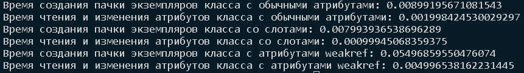
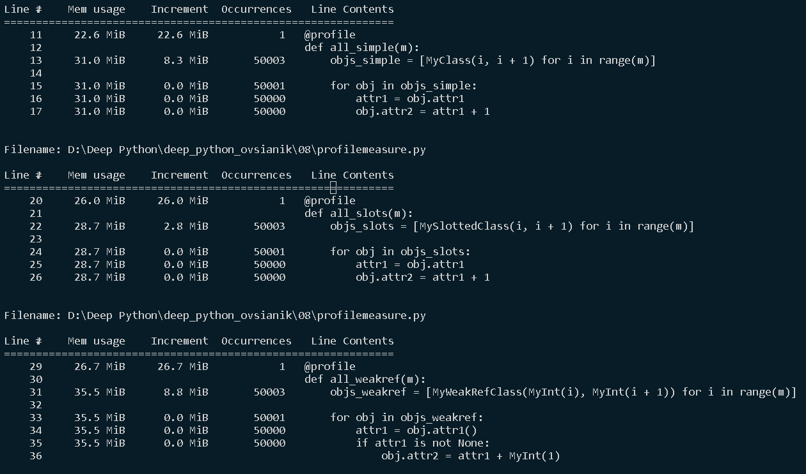

# Выводы

Сравним производительность различных типов классов в Python: обычные классы, классы со слотами и классы с weakref атрибутами.

## Анализ времени

1. Быстрее всего создаются и обрабатываются классы со слотами, так как слоты в Python позволяют экономить время и память, ограничивая динамическое создание атрибутов.

2. Классы с weakref атрибутами требуют больше всего времени на создание и обработку, нежели обычные классы или классы со слотами, так как weakref в Python используется для создания слабых ссылок на объекты, что требует дополнительных ресурсов.

## Анализ памяти

Меньше всего памяти заняло использование классов со слотами.
Это может быть обусловлено тем, что использование слотов позволяет уменьшить размер объектов, выделяя пространство для фиксированного количества атрибутов.
Тогда как обычные классы в Python хранят свои атрибуты в словаре, что занимает дополнительное пространство памяти. Когда создается объект класса, он содержит динамический словарь (классы со слотами позволяют избежать использования динамического словаря), который позволяет добавлять атрибуты. Это может привести к избыточному использованию памяти, особенно если создается большое количество объектов.

